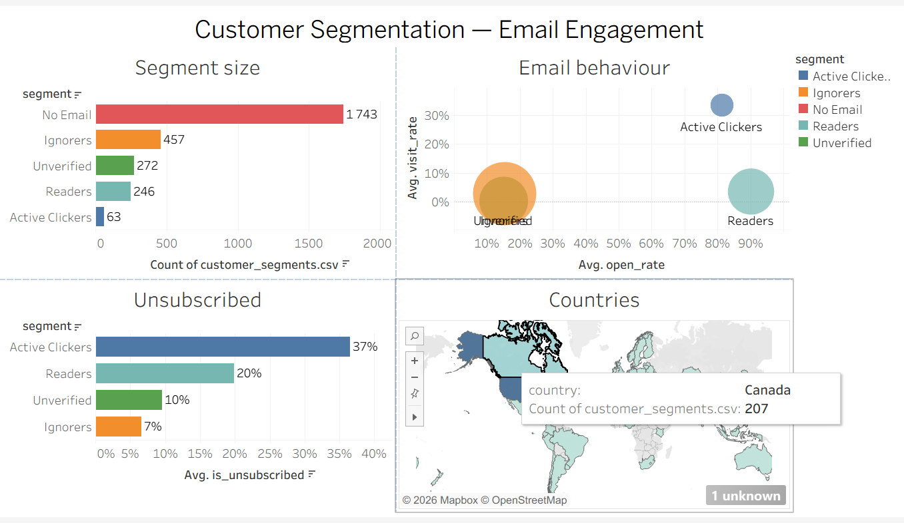

# Customer Segmentation of an Online Store (K-Means)

Segmentation of 2,781 e-commerce customers by order value and email engagement,
to help marketing address each customer group differently.

**Tools:** SQL (Google BigQuery) · Python (pandas, scikit-learn, matplotlib) · Tableau
 **Data:** e-commerce dataset in Google BigQuery (9 tables, ~3 months, 2,781 customers)
 
**Interactive dashboard:** [Tableau Public](https://public.tableau.com/views/CustomerSegmentationEmailEngagement/CustomerSegmentation)
 )
 
## Approach

1. **SQL (BigQuery):** built one feature table per customer from 9 tables of the course dataset.
2. **Data check:** classic RFM analysis turned out to be impossible — every account is linked
   to only one session, so every customer has exactly one order (Frequency = 1 for all).
3. **Feature selection:** order value + email engagement (emails received, open rate, click-through rate).
   Customers who never received an email (63%) form a separate segment.
4. **K-Means clustering:** log transform + standardisation, k chosen with the elbow method
   and silhouette score (k = 4).
5. **Interpretation:** segment profiles, hypothesis check, recommendations.

## Segments

| Segment | Customers | Key behaviour |
|---|---|---|
| No Email | 1,743 | never received an email |
| Ignorers | 457 | receive the most emails, open only 15% |
| Unverified | 272 | few emails — mostly unconfirmed email addresses |
| Readers | 246 | open 90% of emails, but rarely click |
| Active Clickers | 63 | click every third email, smallest orders, highest unsubscribe rate |

## Key findings

- **63% of buyers are not reached by email marketing.**
- A hypothesis was **rejected by the data**: customers who ignore emails unsubscribe *least* —
  because those who unsubscribe stop receiving emails (reversed cause and effect).
- The **most engaged** customers unsubscribe **most often** (37%) — a topic for further research.
- The segments differ mainly in email behaviour, not in order value.

## Recommendations
- **No Email (63%)** — collect and verify email addresses at checkout to bring these customers into email marketing.
- **Unverified** — send a reminder to confirm the email address.
- **Ignorers** — reduce email frequency to avoid fatigue.
- **Active Clickers** — investigate why the most engaged customers unsubscribe most often (e.g. survey or content analysis).
  
## Files

| File | Content |
|---|---|
| `customer_segmentation.ipynb` | full analysis with charts, conclusions and recommendations |
| `rfm_step1.sql` | RFM attempt and data check |
| `segmentation_step2.sql` | feature table per customer |
| [Tableau dashboard](https://public.tableau.com/views/CustomerSegmentationEmailEngagement/CustomerSegmentation) | segment size, email behaviour, unsubscribe rate, countries |

## Limitations

Short period (≈ 3 months), one session per account, moderate cluster separation (silhouette ≈ 0.3).
